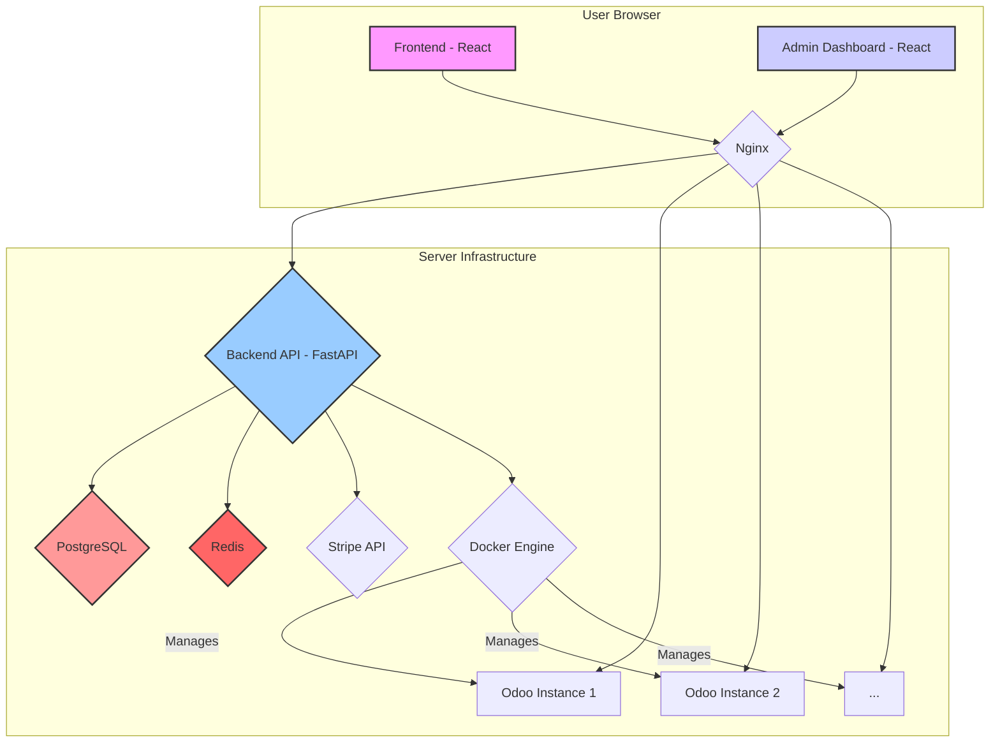

# Odoo SaaS Platform - Architecture

This document provides a detailed overview of the Odoo SaaS Platform architecture.

## System Components

The platform is composed of the following main components:

*   **Frontend**: A React-based single-page application that serves as the main user interface for tenants. It handles user registration, login, subscription management, and Odoo instance access.

*   **Admin Dashboard**: A separate React-based application for platform administrators. It provides a comprehensive interface for managing users, tenants, instances, billing, and system monitoring.

*   **Backend API**: A FastAPI application that serves as the core of the platform. It handles all business logic, including user authentication, tenant management, Odoo instance provisioning, billing integration, and security.

*   **Nginx**: A high-performance reverse proxy that sits in front of all other services. It handles SSL/TLS termination, request routing, load balancing, security headers, and rate limiting.

*   **PostgreSQL**: A robust, open-source relational database used to store all platform data, including user accounts, tenant information, instance details, and billing records.

*   **Redis**: An in-memory data store used for caching, session management, and as a message broker for background tasks.

*   **Docker**: A containerization platform used to package and run all services in isolated environments. This ensures consistency, portability, and scalability.

*   **Odoo Instances**: Each tenant's Odoo instance runs in its own dedicated Docker container, providing strong isolation and security. These instances are provisioned and managed by the backend API.

## Architecture Diagram

## Data Flow

1.  A user accesses the frontend or admin dashboard in their browser.
2.  Nginx receives the request and routes it to the appropriate service (frontend, admin, or backend API).
3.  For API requests, the backend API processes the request, interacts with the database (PostgreSQL) and cache (Redis), and returns a response.
4.  For Odoo instance management, the backend API communicates with the Docker Engine to create, start, stop, or delete Odoo containers.
5.  For billing operations, the backend API communicates with the Stripe API.

## Security

*   **SSL/TLS**: All traffic is encrypted with SSL/TLS certificates from Let's Encrypt.
*   **Authentication**: User authentication is handled with JWT (JSON Web Tokens).
*   **Authorization**: Role-based access control (RBAC) is used to restrict access to resources.
*   **Firewall**: A firewall is configured to allow only necessary traffic.
*   **Security Headers**: Nginx is configured with a comprehensive set of security headers to protect against common web vulnerabilities.
*   **Rate Limiting**: Rate limiting is used to protect against brute-force attacks and DDoS.

## Scalability

The platform is designed to be scalable. You can scale the backend API and Odoo instances horizontally by adding more servers and using a load balancer. The use of Docker makes it easy to deploy and manage services across multiple servers.

